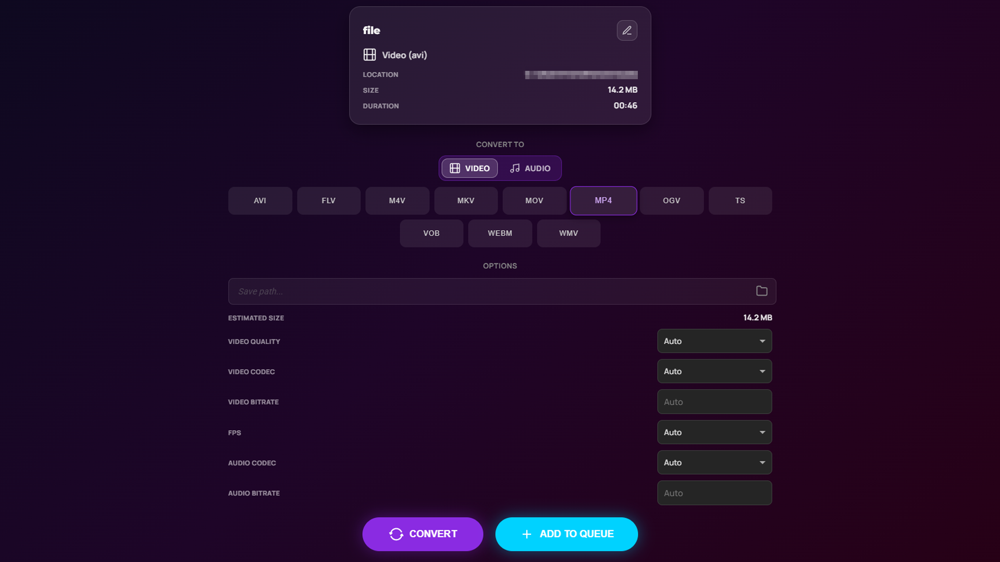
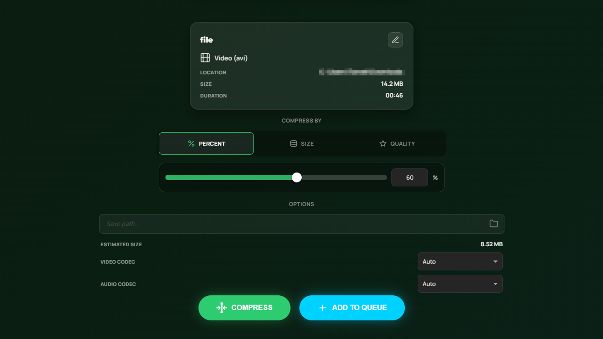

<p align="center">
  
</p>

<p align="center">
  
  
  
</p>

---
<p align="center">High-performance, cross-platform utility designed to redefine how you acquire and manage digital media.</p>

---
## Key Features
* **Modern & Lightweight**: Built with **Tauri v2** and **Rust**, offering a lightning-fast, web-based UI with the memory efficiency of a native application.
* **Smart Queue System**: Add multiple media to a queue, manage priorities, track progress in real-time, and process them efficiently in the background.
* **Auto-Dependency Management**: Automatically downloads and configures the latest versions of **Pulsar Bridge** (custom JSON wrapper) and **ffmpeg** upon first launch via a built-in splash screen. No manual setup required.
* **Cross-Platform**: Runs natively on **Windows**, **macOS** (Apple Silicon), and **Linux**.
* **Flexible Format Control**: Seamlessly choose between video/audio containers and resolutions, embed metadata/thumbnails and many more features.
* **Advanced Options**: Built-in support for Geo-Bypass, specific time-range downloads, and extracting authentication cookies directly from your browser.
* **Theming & Localization**: Dark, Light, and System modes, along with multi-language UI support.
## How it works
Pulsar serves as a user-friendly interface for the powerful **yt-dlp** command-line tool, which is used for downloading media from various online platforms.
When you add a media URL to the queue, Pulsar translates your selections into yt-dlp commands and executes them in the background.
The application continuously monitors the download progress, providing real-time updates on speed, estimated time remaining, and any errors that may occur.
Once the download is complete, you can easily access the media file directly from the app. It serves also **ffmpeg** in converter and compressor mode that is powerful C tool
for processing multimedia files such as videos and audio, allowing you to further customize your media files.
It supports a wide range of formats and options, giving you full control over the output quality and file size.
## How to Install
1. Go to the **[Releases](https://github.com/fuzjajadrowa/Pulsar/releases)** tab and download the latest version for your operating system.
### For Windows (x86_64)
* **Installer (.exe)**: Download the NSIS installer, run it, and follow the on-screen instructions. Pulsar will be available in your Start Menu.
* **Portable (.zip)**: Extract the archive to any folder and run `Pulsar.exe`.

### For macOS (Apple Silicon / aarch64)
* **Installer (.pkg)**: Open the `.pkg` file and follow the on-screen instructions to install Pulsar.
* **Portable (.app.tar.gz)**: Unzip the file and run the `Pulsar.app` bundle.
    * *Note:* If you encounter a damage warning, type in command prompt: ```sudo xattr -cr [Path to Pulsar.app]``` and select **Open** to authorize the first launch.
### For Linux (x86_64)
* **Debian/Ubuntu (.deb)**: Install via your package manager:
  ```bash
  sudo apt install ./Pulsar-X.X.X-Linux.deb
  ```
* **Flatpak (Flathub)**:
  ```bash
  flatpak install flathub pl.fuzjajadrowa.pulsar
  ```
  If Flathub is not configured yet:
  ```bash
  flatpak remote-add --if-not-exists flathub https://flathub.org/repo/flathub.flatpakrepo
  ```
## Building from Source
To build Pulsar yourself, ensure you have **Node.js (v20+)** and the **Rust stable** toolchain installed.
1. Install OS Dependencies
   * Windows / macOS: Usually no extra system packages are required beyond build tools (C++ build tools / Xcode Command Line Tools).
   * Linux (Ubuntu/Debian):
   ```bash
   sudo apt-get update
   sudo apt-get install -y libgtk-3-dev libwebkit2gtk-4.1-dev libayatana-appindicator3-dev librsvg2-dev patchelf
   ```
2. Clone the repository
```bash
  git clone https://github.com/fuzjajadrowa/Pulsar.git
  cd Pulsar
```
3. Install node packages
```bash
  npm install
```
4. Build the application
To compile a release build of the application:
  ```bash
    npx tauri build
  ```
The compiled binaries will be located in src-tauri/target/release/bundle/.
If you just want to run the app in development mode, use:
  ```bash
    npx tauri dev
  ```
## Screenshots
<table align="center">
  <tr>
    <td align="center"></td>
    <td align="center"></td>
  </tr>
  <tr>
    <td align="center"><sub>Home screen</sub></td>
    <td align="center"><sub>Fast and simple downloader</sub></td>
  </tr>
  <tr>
    <td align="center"></td>
    <td align="center"></td>
  </tr>
  <tr>
    <td align="center"><sub>Converter with advanced media options</sub></td>
    <td align="center"><sub>Compressor with many compression types</sub></td>
  </tr>
</table>

## License
Distributed under the terms specified in the LICENSE file.
Powered by [Tauri](https://v2.tauri.app/), [yt-dlp](https://github.com/yt-dlp/yt-dlp), and [ffmpeg](https://ffmpeg.org/).